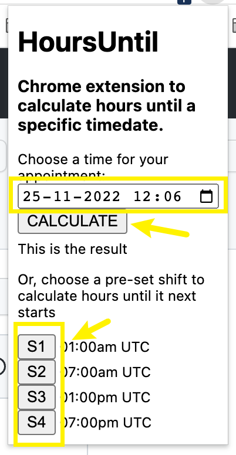
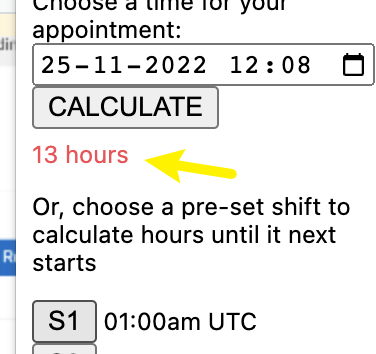

# HoursUntil
Chrome plugin to calculate the number of hours until a specific datetime, from right now. 

It needs your PC clock to be in UTC to be accurate if you'll use the S1-S4 buttons (not much so if you use Calculate).                             

Installation:
- Clone the repo to your local filesystem
- Go to your Chrome manage extensions page (chrome://extensions/)
- Make sure Developer Mode is enabled (on the top right)
- Click on the button "Load Unpacked"
- Select the folder where the extension lives in your local file system (i.e. where you cloned the repo)
- Ignore the errors... (or fork'em, fix'em and pull'em)

Usage:
- Press the plugin icon

- Choose a time and press Calculate, or press one of the preset shifts

- Read the output in the result textbox (which will randomly change colors each time you press a button, for fun)

